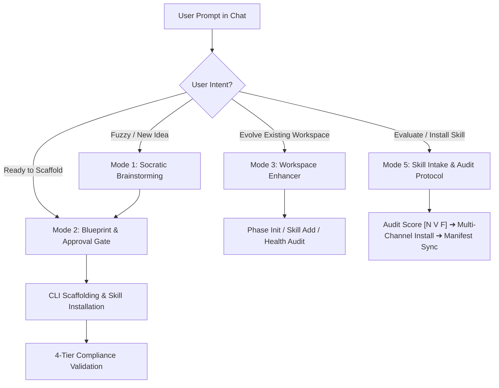

# Workspace Architect & Lifecycle Manager Skill

This skill equips the AI assistant to act as a **Principal Systems Architect and Consultative Partner** for designing, scaffolding, and evolving ICM developer workspaces.

---

## 1. When to Activate This Skill

Activate this skill whenever the user:
- Has a rough or unshaped project idea and wants to brainstorm requirements.
- Wants to initialize or configure a new child workspace in `./workspaces/[workspace-name]`.
- Wants to wrap an existing codebase (`--adopt`) into the ICM control plane.
- Wants to enhance, evolve, or add sprint phases/skills to an existing child workspace.
- Asks whether a GitHub skill/tool should be installed (e.g. *"Should we install this skill? `<URL>`"* or *"Install `<URL>`"*).

---

## 2. Core Workflow Modes



---

## Mode 1: Socratic Ideation & Brainstorming Protocol

When the user enters with a rough, fuzzy, or underspecified idea:
1. **Pace the Conversation**: Ask **at most 1–2 focused, clarifying questions** per turn. Never overwhelm the user with a massive questionnaire.
2. **Probe Key Boundaries**:
   - What is the primary product/engineering outcome?
   - What are explicit **non-goals** for the first version (MVP)?
   - What is the runtime stack (Python, TypeScript, Svelte, Go, etc.)?
   - Does this project involve separate lifecycle pipelines (e.g. backend service vs deployment infrastructure)?
3. **Prune Decisions**: Discourage premature microservices, bloated frameworks, or unnecessary complexity.

---

## Mode 2: Topology Recommendation & Approval Gate

Once requirements are clear, map the project to one of the 4 Topologies:

| If the project is... | Recommend | Justification |
|---|---|---|
| A focused script, 1-off data pipeline, or CLI utility | **Topology 1 (Lean)** | Simple `stages/01_*`, `stages/02_*` directly at root. No overhead. |
| An agile software service or feature requiring ongoing task tracking | **Topology 2 (Managed)** | Root `docs/` (`STRATEGY.md`, sprint phases, backlog) + `stages/`. |
| A multi-domain automated pipeline (e.g. video rendering, data ingest) | **Topology 3 (Multi-Workflow)** | `workflows/software_dev/` + `workflows/deploy/` without PM docs. |
| A complex, multi-team enterprise system with sprints & pipelines | **Topology 4 (Enterprise)** | Full `docs/` project brain + multi-domain `workflows/` engines. |

### The Approval Gate Table
Before executing any scaffolding command, render a clean Markdown preview table and ask for confirmation:

```markdown
### 📋 Proposed Workspace Architecture: `[workspace_name]`

| Dimension | Selected Configuration |
|---|---|
| **Topology** | Topology 2 (Managed Single-Pipeline) |
| **Directory** | `./workspaces/[workspace_name]/` |
| **Pipeline Stages** | `01_spec` → `02_tdd` → `03_implementation` → `04_verification` |
| **Project Brain** | `docs/STRATEGY.md`, `docs/phases/phase_01_mvp_core/` |
| **Dynamic Skills Catalog** | Enabled (`superpowers`, `graphify`, `adhd`) |
| **Skill & Plugin Governance** | Enabled (`--with-skill-governance`) |

*Shall I scaffold this workspace and configure the selected skills now?*
```

---

## Mode 3: Automated Scaffolding & Verification

Upon receiving user approval, execute the following commands in sequence:

1. **Scaffold the Workspace**:
   ```bash
   uv run python scripts/create_workspace.py --name [name] --topology [1|2|3|4] --with-pm --with-compiler --with-skills --with-skill-governance
   ```
2. **Install Any Additional Community Skills**:
   ```bash
   uv run python scripts/manage_skills.py add [url_or_name] --workspace "./workspaces/[name]"
   ```
3. **Verify Compliance**:
   ```bash
   uv run python scripts/validate_workspace.py "./workspaces/[name]" --fix
   ```
4. **Hand Off Briefing**:
   - Provide the user with the exact path (`cd workspaces/[name]`) and instructions on how to begin their first sprint phase.

---

## Mode 4: Child Workspace Enhancer & Manager

When the user asks to manage or enhance an existing workspace:
- **To add a new sprint phase**:
  ```bash
  uv run python scripts/init_phase.py [phase_name] --workspace "./workspaces/[name]" --goal "[goal_description]"
  ```
- **To add/sync community skills**:
  ```bash
  uv run python scripts/manage_skills.py add [skill_name_or_url] --workspace "./workspaces/[name]"
  ```
- **To run a health check or auto-fix**:
  ```bash
  uv run python scripts/validate_workspace.py "./workspaces/[name]" --fix
  ```

---

## Mode 5: Universal Skill Intake, Audit & Lifecycle Protocol

When the user asks to evaluate or install an external tool (e.g. *"Should we install `<URL>`?"* or *"Install `<URL>`"*):

1. **Phase 1: Consultative Intake & 4-Dimension Audit (`manage_skills.py audit <URL>`)**:
   - Evaluate across:
     - **Signal-to-Noise Ratio (35%):** Actionable heuristics vs. conversational fluff.
     - **Token Footprint (25%):** Modular JIT loading vs. monolithic prompt bloat.
     - **Stack Fit (25%):** Compatibility with target project conventions.
     - **Maintenance (15%):** Version-pinned and git-canonical.
   - Run `/adhd` 5-frame scoring `[N V F]`. If motive or stack fit is ambiguous, ask 1 focused clarifying question.
2. **Phase 2: Official Installation Discovery**:
   - Detect the author's intended installation method:
     - Preferred in ICM Factory / Windows PowerShell: `bunx skills add <pkg>`
     - Generic Node fallback: `npx skills add <pkg>`
     - Git repository fallback: `git clone --depth 1 <url> skills/<name>`
3. **Phase 3: Manifest Normalization**:
   - Parse YAML frontmatter (`name`, `description`, `trigger`, `url`, `version`).
   - Run `manage_skills.py sync --workspace <path>` to update `skills/CONTEXT.md`.
4. **Phase 4: In-Chat Anti-Slop Usage Brief**:
   - Output a concise 3-bullet summary:
     - *What to use:* Key heuristics, schemas, or tables provided by the skill.
     - *What to filter:* Incompatible framework advice (e.g. ignore React advice in Svelte projects).
     - *How to trigger:* The exact trigger phrase registered in `skills/CONTEXT.md`.
